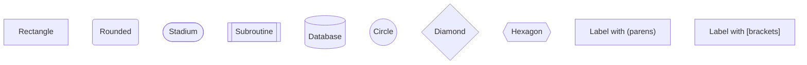

# Mermaid Diagram Generation

When generating Mermaid diagrams, follow these rules to ensure valid syntax.

## Universal Rules

1. **Avoid special characters in labels** - Characters like `::`, `<`, `>`, `|`, `{`, `}` often have special meaning
2. **Quote labels with spaces** - Use quotes around labels containing spaces: `A["My Label"]`
3. **No empty lines inside diagram blocks** - Keep diagram content contiguous

## stateDiagram-v2

### Known Limitations

- **Do NOT use `::` in transition labels** - The `::` sequence is interpreted as special syntax
  ```mermaid
  %% BAD - will cause parse error
  stateDiagram-v2
      [*] --> Created: Link::Created

  %% GOOD - use spaces or other separators
  stateDiagram-v2
      [*] --> Created : Link Created
      [*] --> Created : Link/Created
      [*] --> Created : Link_Created
  ```

- **State names must be simple identifiers** - No special characters in state names
- **Use spaces around `:` in transitions** - `A --> B : label` not `A --> B:label`

## flowchart / graph

### Syntax Tips



### Known Limitations

- **Escape special characters in labels** - Use quotes and HTML entities when needed
- **Subgraph IDs must be unique** - Don't reuse IDs across subgraphs

## sequenceDiagram

### Syntax Tips


### Known Limitations

- **Participant names with spaces** - Use `participant X as "Name With Spaces"`
- **Messages cannot contain `-->`** - This is reserved syntax

## erDiagram

### Syntax Tips


### Cardinality Symbols

| Symbol | Meaning |
|--------|---------|
| `\|\|` | Exactly one |
| `o\|` | Zero or one |
| `}o` | Zero or many |
| `}\|` | One or many |

### Known Limitations

- **Entity names must be single words** - Use underscores: `LINE_ITEM` not `Line Item`
- **Relationship labels with spaces need quotes** - `"is in"` not `is in`

## classDiagram

### Syntax Tips


### Known Limitations

- **Generic types** - Use `List~String~` not `List<String>` (tildes instead of angle brackets)
- **Method signatures** - Keep them simple, complex signatures may not parse

## gantt

### Syntax Tips


### Known Limitations

- **Task names cannot contain `:` or `,`** - These are delimiter characters
- **Section names cannot be empty** - Must have at least one character

## Viewing Diagrams

Use the mermaid_view tool to render diagrams in the browser:
```bash
~/wealthsimple/scripts/mermaid_view/mermaid_view.js "flowchart TD\n    A --> B"
```

## Troubleshooting

If a diagram fails to render:

1. **Check for reserved characters** - `::`, `-->`, `|`, etc. in labels
2. **Validate quotes** - Labels with special chars need proper quoting
3. **Simplify and rebuild** - Start with minimal diagram, add complexity incrementally
4. **Check Mermaid version** - Some syntax is version-specific
